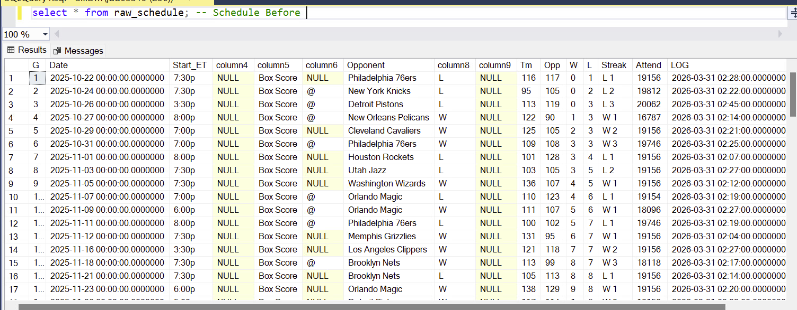
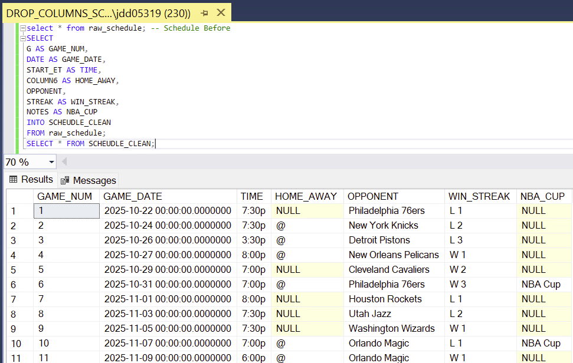
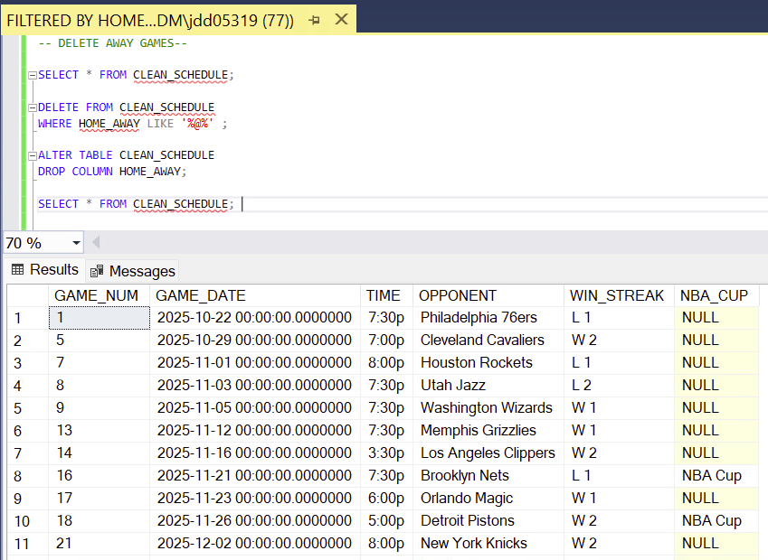
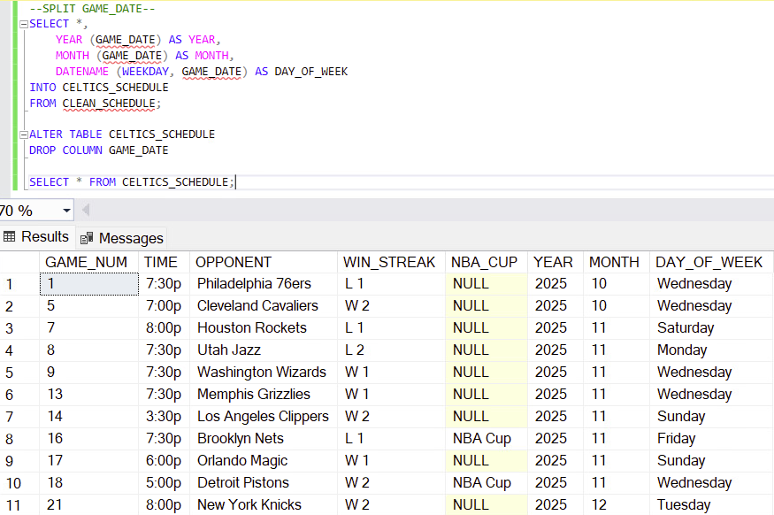
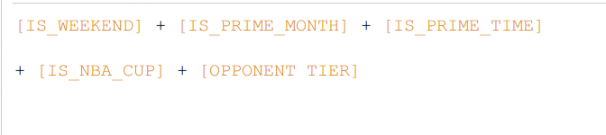
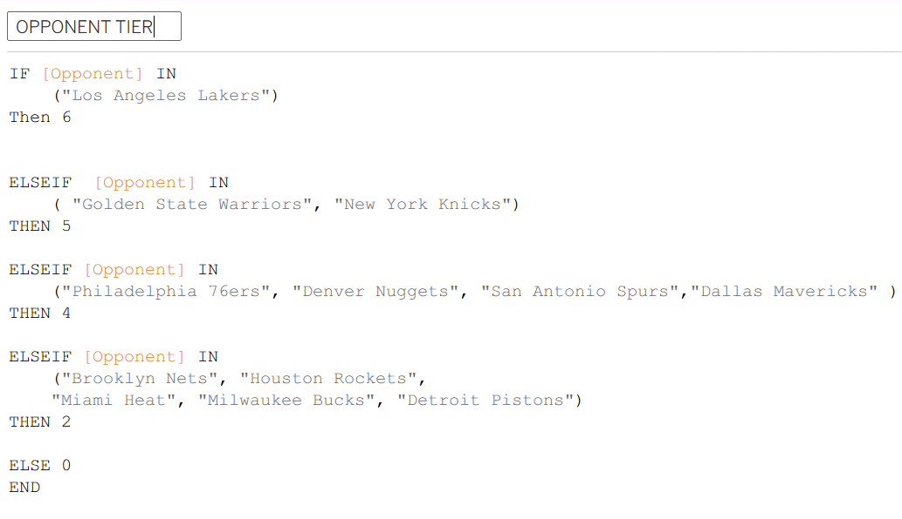
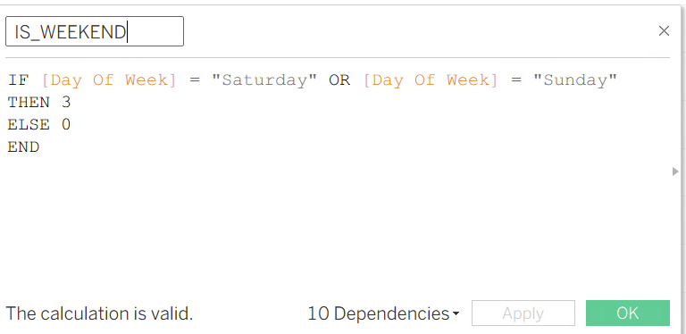
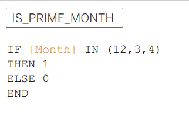
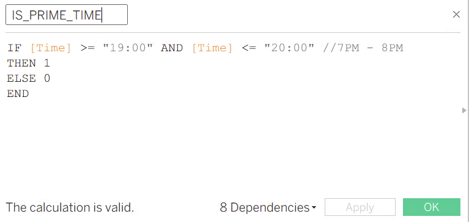

Hi all! 

## Table of Contents

- [Introduction](#Introduction)
- [Data](#Data)
- [Formula Creation](#Formula-Creation)
- [Dashboards Built](#Dashboards-Built)
- [Overall Insights](#Overall-Insights)


  # Introduction
  - In this project, I developed a Tableau dashboard to analyze Boston Celtics home game demand. I created a proxy metric called the Game Attractiveness Score to evaluate how scheduling factors and opponent strength impact expected fan interest and overall demand patterns
 
End to End Analytics Pipeline:
```
Data --> SQL Database --> SQL Cleaning --> Dashboard Deisgn --> Overall Insights
```


# Data

The dataset was sourced from Basketball Reference and includes Celtics game schedule information. Data was cleaned and structured in SQL, with key fields including game number, opponent, game timing, and indicators such as home/away and special event games. The dataset was filtered to focus on home games only.

## Data Before (AS CSV)
  

## SQL CLENAING:
  1. Drop unwanted Columns
 

  2. Filtered Home Games
 

  3. Split up Date Column
 

# Formula Creation

- A custom “Game Attractiveness Score” (G.A.S) was developed as a proxy for demand due to limited attendance variability in the dataset. The score assigns weighted values based on key demand drivers, including weekend games, marquee opponents, and special game contexts. Additional calculated fields were created in Tableau to support analysis and visualization.

## Game Attractiveness Score (G.A.S)


## Scoring Metrics






  
  
